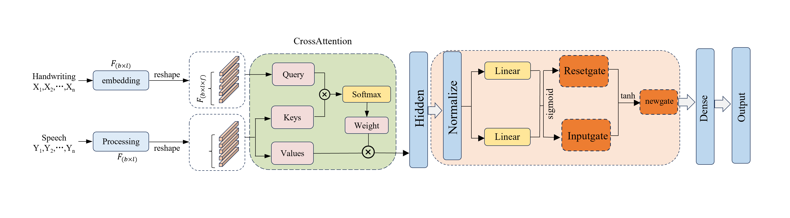

# GRU_CrossAttention ---- Application of Sequence Models in the AD&amp;MCI

*This repository is dedicated to making data preprocessing and related model parameters publicly available, which can further expand the research of behavioral data in the field of Alzheimer’s.*



**Project dependency environment:**
```base
pip install -r requirement.txt
```

**Feature Engineering**

1. feature_select

2. Dynamic Time Warping

3. PCA dimensionality reduction


**Train_Model**
1. gru_cell

2. cross_attention


Statement: 
*Due to the privacy issues involved in the data of this study, relevant behavioral and characteristic data can be obtained by contacting the author's email.*
